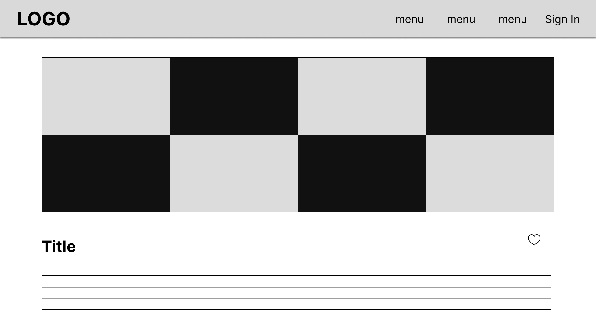

### **Project Senior Project TI**

### Kelompok Rice Lovers

| Jabatan | Nama | NIM |
| --- | --- | --- |
| Ketua | [Yosep E Christo](https://github.com/YosepEChristo) | 19/446788/TK/49893 |
| Anggota 1 | [Btari Fatma Rosa](https://github.com/BetNares) | 20/456361/TK/50491 |
| Anggota 2 | [Kurnia Dwi Utami](https://github.com/kurniakdu) | 20/456369/TK/50499 |

**Departemen Teknik Elektro dan Teknologi Informasi, Fakultas Teknik, Universitas Gadjah Mada**
---
## Produk
Nama: demiNASIonal 
Jenis: Aplikasi web

## Latar Belakang & Permasalahan

Indonesia adalah negara agraris. Sebagian besar penduduk Indonesia berprofesi sebagai petani, terutama petani padi[1]. Tidak hanya sebagai komoditas pertanian, salah satu makanan pokok yang paling dikonsumsi oleh penduduk Indonesia adalah nasi yang berasal dari Padi [2]. Dengan demikian, kesehatan tanaman padi menjadi penting dan perlu diperhatikan sehingga mutu dan kualitas hasil pertanian dan bahan pangan terjamin baik. Oleh karena itu, kami merancang aplikasi Demi NASIonal untuk membantu petani agar dapat memproduksi padi dengan kualitas baik dan mengurangi kemungkinan gagal panen.

Penyakit rice brown spot dan leaf blast menyebabkan kehilangan hasil panen sebesar 5% di seluruh produksi padi dataran rendah di Asia Selatan dan Tenggara[3]. Blast disebabkan oleh Magnaporthe oryzae, sedangkan Bipolaris oryzae dilaporkan sebagai organisme penyebab utama brown spot. Kedua penyakit ini memiliki penyebab yang sama, yaitu jamur, dan keduanya menyebabkan lesi daun yang sulit dibedakan hingga tahap infeksi selanjutnya. 

### Rumusan masalah

1. Sulitnya membedakan antara penyakit brown spot dan leaf blast serta penanganannya yang benar.

### Referensi
[1] [Alasan Indonesia Disebut Negara Agraris, Salah Satunya Ekonomi Ditopang Oleh Petani Halaman all - Kompas.com](https://regional.kompas.com/read/2022/08/03/215851878/alasan-indonesia-disebut-negara-agraris-salah-satunya-ekonomi-ditopang-oleh?page=all#:~:text=Jumlah%20penduduk%20Indonesia%20yang%20bekerja%20di%20bidang%20pertanian,Indonesia%20yang%20berprofesi%20sebagai%20petani%20mencapai%209.749.093%20jiwa.)  
[2] [Kenapa Nasi Jadi Makanan Pokok Kita? - Kelas Pintar](https://www.kelaspintar.id/blog/edutech/kenapa-nasi-jadi-makanan-pokok-kita-5058/)  
[3] [Brown spot - IRRI Rice Knowledge Bank](http://www.knowledgebank.irri.org/training/fact-sheets/pest-management/diseases/item/brown-spot)

## Ide Solusi

Kami menawarkan solusi berupa aplikasi web yang dapat melakukan pengklasifikasian penyakit tanaman padi yang disebabkan oleh jamur, yaitu Brown Spot dan Leaf Blast. Aplikasi tersebut juga akan memberikan edukasi kepada user mengenai penyakit pada padi.

### Rancangan Fitur Solusi

| Fitur | Keterangan |
| --- | --- |
| Artikel | Fitur ini memberikan informasi mengenai penyakit pada padi yang disebabkan oleh jamur. |
| Klasifikasi | Fitur ini memberikan hasil klasifikasi penyakit pada padi, apakah padi terkena brown spot, leaf blast, atau tidak terkena penyakit apapun berdasarkan foto yang diunggah.  |
| Penanganan | Fitur ini memberikan Informasi penanganan terhadap padi yang terserang penyakit Brown Spot atau Leaf Blast.  |

## Analisis Kompetitor

### Rice Doctor

| Kompetitor 1 | Rice Doctor |
| --- | --- |
| Nama Produk | Rice Doctor |
| Jenis Kompetitor | Direct |
| Jenis Produk | Aplikasi Mobile |
| Target Customer | Petani di Odisha, India |
| Key Competitive Advantage & Unique Value | Memiliki fitur paling lengkap. |

| Kelebihan | Kekurangan |
| --- | --- |
| + Menyediakan fitur peta persebaran penyakit di sawah. | - Berbahasa inggris |
| + Memiliki klasifikasi penyakit yang cukup lengkap | - hanya berupa aplikasi android  |
| | - Aplikasi yang beroperasi di India |

### Riceye

| Kompetitor 2 | Riceye |
| --- | --- |
| Nama Produk | Riceye |
| Jenis Kompetitor | Direct |
| Jenis Produk | Aplikasi Mobile |
| Target Customer | Petani |
| Key Competitive Advantage & Unique Value | Sangat sederhana dan mudah dipakai. |

| Kelebihan | Kekurangan |
| --- | --- |
| + Dapat mendeteksi penyakit langsung dari kamera handphone | - Berbahasa inggris |
|   | - Tidak ada fitur lain selain pendeteksi  |

### Plantix

| Kompetitor 3 | Plantix |
| --- | --- |
| Nama Produk | Plantix |
| Jenis Kompetitor | Direct |
| Jenis Produk | Aplikasi Mobile |
| Target Customer | Petani |
| Key Competitive Advantage & Unique Value | Mampu mendeteksi banyak tanaman dan penyakit, serta real time. |

| Kelebihan | Kekurangan |
| --- | --- |
| + Tersedia dalam 18 bahasa | - Klasifikasi pada tumbuhan terlalu umum yang menentukan tumbuhan sehat atau tidak. |
| + Fitur kalkulator pupuk yang dibutuhkan petani | - Tidak memiliki klasifikasi khusus penyakit yang dialami Tanaman |
| + Dapat mendeteksi 30 jenis tanaman dan 520 jenis penyakit tanaman |  |

---

## SDLC

Metodologi yang digunakan: **Agile**  
Agile merupakan metodologi yang fleksibel terhadap perubahan yang terjadi pada requirement yang ada dan cocok untuk mengerjakan proyek dalam waktu singkat. Selain itu dengan adanya sprint pada Agile yang memungkinkan untuk memonitoring kemajuan dari masing masing individu dalam suatu sprint dan mengadakan evaluasi berdasarkan setiap masalah yang terjadi pada stpint tersebut. 

### Tujuan Produk

Produk ini bertujuan membantu petani untuk mengenali penyakit tanaman padi dan cara mengatasinya sehingga dapat memproduksi padi dengan kualitas baik dan mengurangi kemungkinan gagal panen.

### Pengguna Potensial dan Kebutuhan Pengguna

Pengguna potensial produk adalah petani padi.  
Para pengguna perlu mengetahui, mengenali, dan menangani penyakit tanaman padi yang dihadapi.

### Use Case Diagram 

### Functional Requirement

| FR | Deskripsi |
| --- | --- |
| Sign Up | Pada halaman ini, pengguna mendaftarkan dirinya menggunakan email |
| Sign In | Pada halaman ini, pengguna akan memasukkan email dan password untuk masuk ke aplikasi |
| Home Page | Pada halaman ini, memuat fitur yang disediakan Rice Lover seperti yaitu artikel dan upload foto |
| Artikel | Pada halaman ini pengguna dapat melihat dan membaca post atau artikel terkait dengan penyakit pada padi |
| Upload Foto | Pengguna dapat mengambil gambar kulit yang nantinya akan dikirim untuk dianalisis menggunakan AI milik Rice Lovers |
| Rekomendasi Tindakan | Pada halaman ini, pengguna dapat melihat hasil beserta rekomendasi dari klasifikasi berdasarkan gambar padi yang dikirim |
  
### ERD 

### Low-Fidelity Wireframe

 

 Sign In 

  

 

 Sign Up 

  

 

 Home Page 

  

 

 Daftar Artikel 

  

 

 Artikel 

  

 

 Upload Foto 

  

 

 Rekomendasi Tindakan 

  

### Gantt Chart

